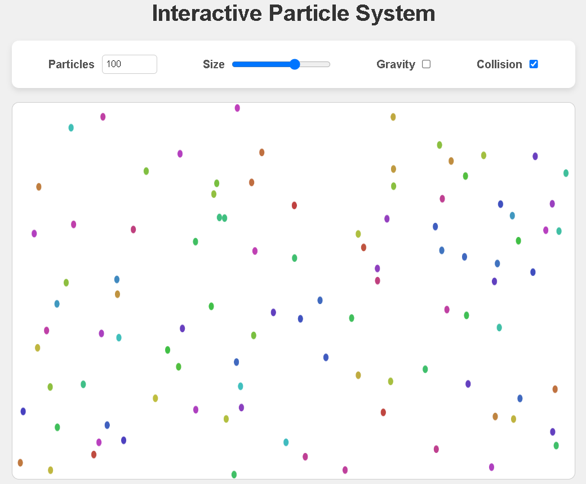

# Interactive Particle System

This project demonstrates an interactive particle system using JavaScript and the HTML5 Canvas API. The system allows for the simulation of particles that react to gravity, collisions with each other, and collisions with the canvas boundaries.



## Features

- **Particle Count Control**: Adjust the number of particles in the system.
- **Particle Size Control**: Change the size of the particles.
- **Gravity Toggle**: Enable or disable gravity affecting the particles.
- **Collision Toggle**: Enable or disable particle collision detection and response.

## Getting Started

To get a local copy up and running, follow these simple steps.

### Prerequisites

You need a modern web browser to view the project. No additional software is required.

### Installation

1. Clone the repo
   ```sh
   git clone https://github.com/YZvirblis/js-particles.git
   ```
2. Open `index.html` in your browser

## Usage

- Adjust the number of particles using the `Particles` input.
- Change the size of the particles using the `Size` slider.
- Toggle the `Gravity` and `Collision` checkboxes to enable or disable these features.

## Acknowledgements

- [MDN Web Docs](https://developer.mozilla.org/en-US/docs/Web/API/Canvas_API) - For the detailed documentation on the Canvas API.
- [Stack Overflow](https://stackoverflow.com) - For the numerous answers that helped in troubleshooting and enhancing the project.

## Contact

Yuriy Zhvirblis - [LinkedIn](https://www.linkedin.com/in/yuriy-zvirblis/) - [Email](mailto:yuriyzdev@gmail.com)

Project Link: [https://github.com/YZvirblis/js-particles](https://github.com/YZvirblis/js-particles)
